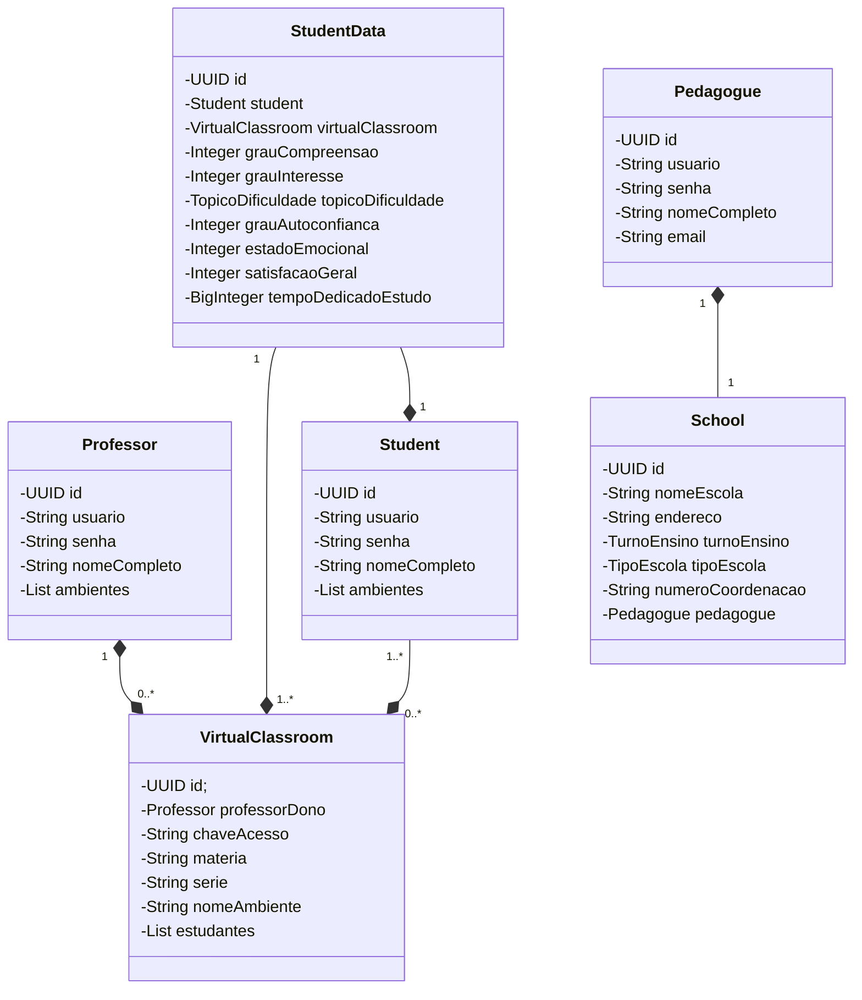

# Darcy API
Aplicação Back-end desenvolvida para as matérias de POO, Programação Front-end, Redes de Computadores e Projeto Integrador III.

## 📖 Sumário
- [1. Domínio da aplicação](#1--domínio-da-aplicação)
  - [1.1 Descrição das entidades](#11-descrição-das-entidades)
  - [1.2 Diagrama de classes](#12-diagrama-de-classes)
- [2. Funcionalidades](#2--funcionalidades)
- [3. Tecnologias](#3--tecnologias)
- [4. Documentação](#5--documentação)

## 1. 🌍 Domínio da aplicação
A aplicação está centrada em um domínio escolar, com professores e estudantes sendo os atores principais do sistema, com o objetivo gerenciar dados de feedbacks estudantis e de acompanhamento.

### 1.1 Descrição das entidades
A seguir, estão as entidades que fazem parte do domínio da aplicação:
- Professor ( Professor capaz de criar e gerenciar novos ambientes virtuais )
- Student ( Estudante que pode se conectar a um ambiente virtual )
- VirtualClassroom ( Ambiente virtual que representa uma "sala de aula" )
- StudentData ( Gerenciar os dados de coleta de feedbacks dos estudantes )
- School ( Escola a qual pertence o contexto do ambiente virtual )
- Pedagogue ( Pedagogo que está presente no núcleo escolar )

### 1.2 Diagrama de classes

## 2. ⚙️ Funcionalidades
Funcionalidades fornecidas pela API:
- Operações CRUD
- Security

## 3. 💻 Tecnologias
Tecnologias utilizadas para desenvolvimento:
- Spring Framework ( Framework Core da aplicação )
- Maven ( Gerenciador de dependências )
- Spring Boot ( Codebase da aplicação )
- Spring Data JPA ( Integração e conexão com banco de dados )
- Spring Security ( Proteção de rotas e dados )
- PostgreSQL ( SGBD )

## 4. 📝 Documentação
A documentação da API foi feita com a especificação Swagger e está disponível na URI: ``/api/v1/swagger-ui/index.html``
